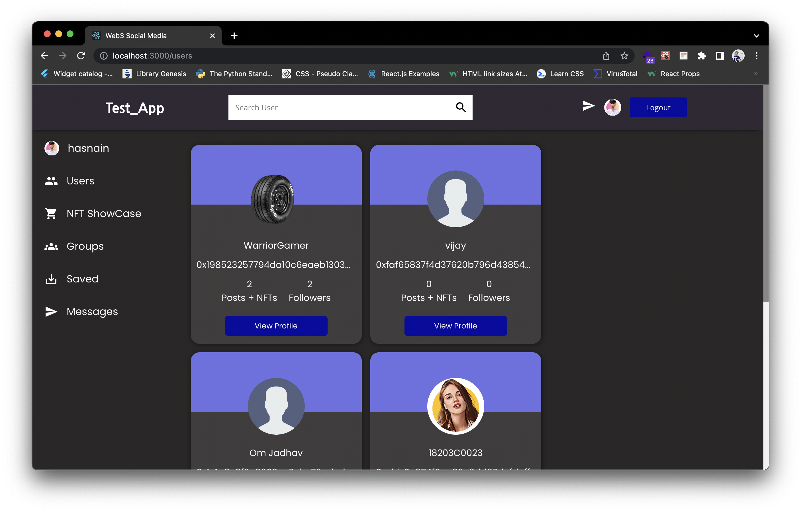

# ReachMe - Be simple, Be Social
## For a better virtual experience!

### Team name: Dark Coders

## Team members
* Ronak Lala - ronaklala2010@gmail.com
* Adil Khatri - adilaqzma@gmail.com
* Om Jadhav - omjadhav963@gmail.com
* Hasnain Sayyed - hasnainsayyed833@gmail.com

## Note
* To mint an NFT you must switch to Rinkeby Test Network

## Description

* ReachMe refers to the means of interactions among people in which they create, share, and/or exchange information and ideas in virtual communities and networks

## Links
* GitHub Repo link: [Link to repository](https://github.com/ronaklala/Web3_Social_media)

## Technology stack

Tools and technologies that you learnt and used in the project.

1. M - Mongo DB
2. E - Express JS
3. R - React JS
4. N - Node JS
5. Firebase 
6. Moralis
7. Rarible Laziminting NFTs

## Applications
* Users can connect with the other users virtually and can communicate with them via chats.
* One can create groups and oher user can join that group.
* Users can give a tip through his metamask wallet to the shared post were the eth will be credited to the owner of that post.
* Users can like, comment and save the post.
* Users can mint the nft and can view it on rinkeby.
* One can search the user by entering his name. 

## Future scope
Adding Group Chats for Groups and Updating Groups Description and Group Information and Making a Sale order from Minted NFT from our Platform, Adding an Ecommerce System where user can list and purchase items with cryptocurrency on Block Chain Platforms

## Screenshots
|  |  |  |  |
| :-------------: | :-------------:  | :-------------:  | :-------------:  |
|     Register Page     |    Login Page   |    Home Page     |     NFT on rinkeby     |

|  |  |  |  |
| :-------------: | :-------------:  | :-------------:  | :-------------:  | 
|     User Profile Page     |    All User   |    Group     |     Group Description     |

|  |  |  |  |
| :-------------: | :-------------:  | :-------------:  | :-------------:  | 
|     Message Page     |    NFT Mint   |    Post Detail     |     Search     |

<!-- - **Admin Panel**

 -->

<!-- - **Model that will extract the submitiles from the YouTube Video and generate subjetive questions** -->
 
<!-- 

 -->
